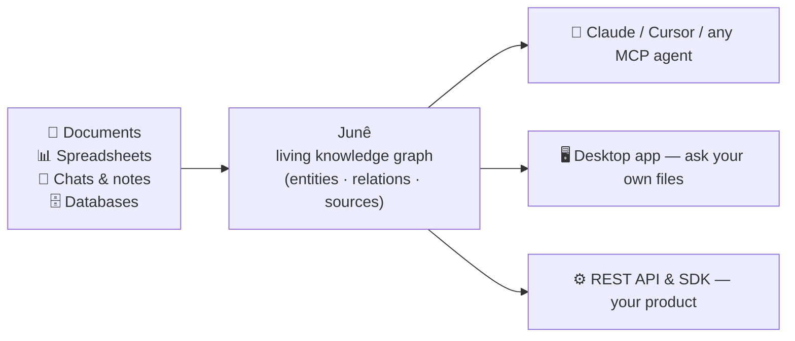

<div align="center">

# Junê

### The context engine for AI agents.

Your agent is brilliant for one message at a time — then it forgets everything.
Junê is the layer that fixes that: it turns your files, chats, and data into one
**living knowledge graph**, and serves any agent the exact, **cited** context it
needs. Local-first. Your data and your API keys never leave your machine.

[**Website**](https://june.januraine.ai) ·
[**Download the app**](https://github.com/Junemind/June_releases/releases) ·
[**Reproduce our benchmarks**](https://github.com/Junemind/june-bench) ·
[**Connect your agent**](https://github.com/Junemind/june-mcp)

[](https://pypi.org/project/june-bench/)
[](https://pypi.org/project/june-mcp/)
[](https://pypi.org/project/june-ai/)

</div>

---

## The problem

Every AI agent hits the same wall. Not intelligence — **context**. Your knowledge
is scattered across PDFs, spreadsheets, databases, and chat histories; your agent
sees a 200k-token window of it, once, and starts from zero next session. Teams
duct-tape RAG pipelines and memory hacks around this, per agent, forever.

Junê's bet: context should be **infrastructure** — one graph, built once,
serving every agent you run.

## What Junê does



Drop files in — the graph builds itself. Ask questions — answers come back
**grounded and cited**, every claim traceable to its source. Connect agents —
they read and write the same graph through an open connector, so what one agent
learns, the next one knows.

- **Local-first.** The engine, the graph, and your data live on your machine.
  Bring your own LLM key or run the free tier without one.
- **Cited, not confabulated.** Every answer points at the passages it came from.
  An answer that can't be grounded says so.
- **Multi-hop.** "Which vendor from the March contracts also appears in the audit
  spreadsheet?" is one question, not five.
- **Agent-native.** MCP server, REST API, and SDK — the same graph behind all of
  them.

## Don't take our word for it — run the benchmark

Most memory-layer claims can't be checked. Ours can, in one command:

```bash
pip install june-bench
june-bench reproduce-h2h
```

That runs Junê and the leading open-source alternative **head-to-head** on public
datasets (LongMemEval, LoCoMo, HotpotQA, FinanceBench) under a matched protocol —
same evidence pool, same answer model, same judge, same embedder — and prints
accuracy and **metered cost** side by side. The result we publish: **matching or
better accuracy at 20–25× lower cost.** The harness resets databases before every
run, meters cost from provider billing deltas (not estimates), and bakes no score
into the package. If we're wrong, your terminal will say so.

Full protocol notes and published results: [june-bench](https://github.com/Junemind/june-bench) · [june.januraine.ai](https://june.januraine.ai)

## Get started in 60 seconds

**Ask your own files** — [download the desktop app](https://github.com/Junemind/June_releases/releases)
(macOS `.dmg` / Windows `.exe`), drop files in, ask. Free tier is full-featured
and local.

**Give your agent memory** — `pip install june-mcp`, add one entry to your MCP
config, and Claude Desktop / Claude Code / Cursor / Gemini CLI gets `june_answer`,
`june_remember`, `june_search`, and friends against your graph.

**Build on it** — the REST API (`/v1/answer`, `/v1/ingest`, `/v1/canvases`) runs
locally with the app or hosted. Request a hosted key: **access@januraine.ai**.

## Why is the engine closed-source?

By design — and we'd rather show you than tell you. The public artifacts are
[**june-bench**](https://github.com/Junemind/june-bench), which reproduces every
number we publish end-to-end on your machine, and
[**june-mcp**](https://github.com/Junemind/june-mcp), the open connector. The
engine ships as installable apps and a hosted API. A benchmark can be argued
with; we made ours runnable instead.

---

<div align="center">

**Junê** · built by [Junemind](https://june.januraine.ai) · access@januraine.ai

*Context is the bottleneck. We're building the layer that removes it.*

</div>
